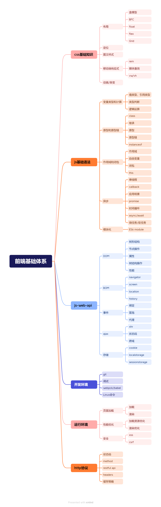

## 面试的涵盖点

1. 前端基础知识
2. 数据结构和算法
3. 编写高质量代码
4. 实际工作经验
5. 知识广度
6. 知识深度
7. 项目设计
8. 分析和解决问题
9. 软技能

## 高级前端要求

1. 基础知识扎实
2. 有能力写出高质量代码
3. 能够思路清晰地分析并解决问题
4. 能基于时间、空间复杂度优化算法
5. 具备沟通能力和学习能力

::: tip
上述 2 者实际上是对应的
:::

## 程序员面试难度划分

1. 基层工程师：基础知识
2. 高级工程师：基础知识+项目经验
3. 架构师：解决方案能力

## 如何准备面试题

1. 根据题目挖到对应的知识点
2. 分析、扩充并完善该知识点
3. 学会该知识点后再自己描述答案

## 基础技能

1. 熟悉 h5、c3、js 基础语法
2. 能使用 ajax,了解 http 协议
3. 看过 vue,react,vite(webpack/rollup)的官方文档

## 高频考点

1. h5、c3
2. js 基础语法：原型、作用域、异步等
3. js web api：DOM 事件、ajax、跨域等
4. 性能优化
5. 各种手写代码
6. http 协议

## 前端知识体系

知识体系：结构化，涵盖所有知识点
::: tip
高效学习三部曲：找准知识体系->刻意训练->及时反馈
:::

梳理知识体系入手：w3c 标准+ecma 262 标准+开发环境+运行环境

